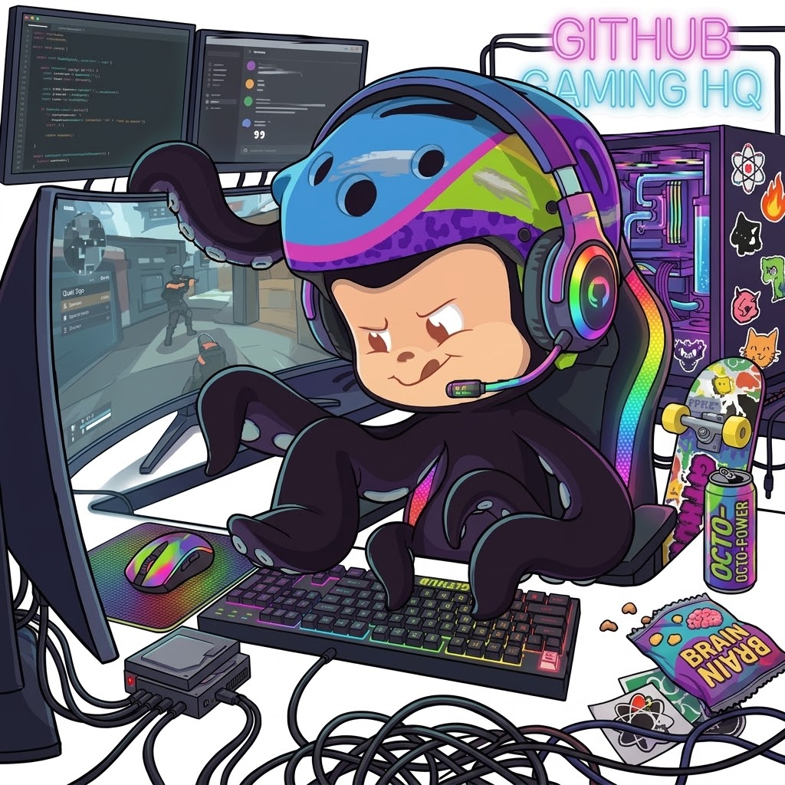

<!-- 🎮 Nescau's GitHub Profile - Banner animado -->

  

---

<!-- 🐱 Gato + Nescau.exe -->

<table align="center">
  <tr>
    <td align="center" width="50%">

      

    </td>

    <td align="left" width="50%">

### 👾 Nescau.exe

🎓 ADS Student  
💻 Developer in progress  
🐧 Linux enthusiast  
🎮 Gamer  

    </td>
  </tr>
</table>

---

## 🚀 Frameworks & Estruturas

  

---

## 💻 Linguagens

  

---

## 🗄️ Banco de Dados

  

---

## 🔧 Infraestrutura & DevOps

  

---

## 🔥 GitHub Streak

  

---

## 📊 GitHub Stats

  
   
  

---

## 🌐 Meus Contatos

  

  

  

<!-- Proudly created with GPRM ( https://gprm.itsvg.in ) -->
